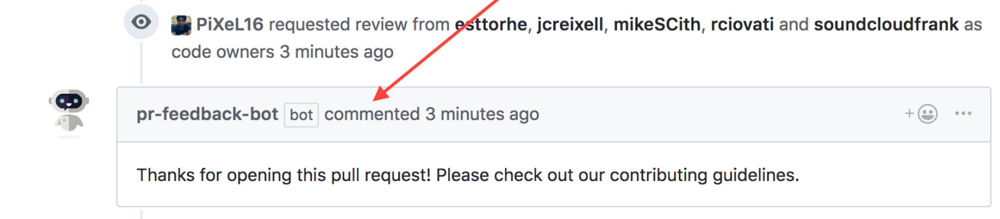

# pr-bot

> A GitHub App built with [Probot](https://github.com/probot/probot) that gives you feedback when Opening and Merging PRs. Useful for showing deployment instructions, PR review expectations, etc.



## Setup

```sh
# Install dependencies
npm install

# Run the bot
npm start
```

## Usage
Add a `config.yml` file in your repository under the `.github` folder. In your `config.yml` file you can add your PR and Merge messages.

```yml
# Comment to be posted to on PRs
newPRComment: >
  Thanks for opening this pull request! Please check out our contributing guidelines.
# Comment to be posted to on pull requests merged
PRMergeComment: >
  Congrats on merging your pull request! We here are proud of you!
```

## Contributing

If you have suggestions for how pr-bot could be improved, or want to report a bug, open an issue! We'd love all and any contributions.

For more, check out the [Contributing Guide](CONTRIBUTING.md).